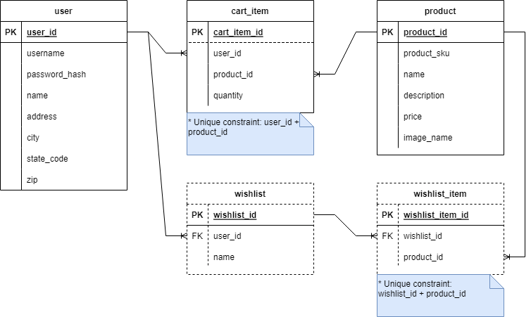

# Module Two final project

In this project, you'll build a REST API to support an e-commerce shopping cart.

The [Requirements](#requirements) section later in this document describes the endpoints needed.

## Database setup

To run the application, you must first create the `m2_final_project` database. Then run the `database/m2_final_project.sql` script to create the tables with some test users and data.

> Note: The script creates two users for testing, `user` and `admin`, which both have the password: `password`.

## Starting code

Begin by opening the Module Two final project in IntelliJ and reviewing the starting code.

The project contains code to support user authentication. This code includes JavaDoc comments explaining the purpose of the classes and methods.

## Requirements

The requirements are for a RESTful web API only. There are no requirements for a user interface. Perform testing of the required endpoints by using Postman.

There are three groupings of requirements:

- **Provided**: documents the provided features in the starter code
- **Required**: features required to complete the project
- **Bonus**: optional features to extend the project and further develop your skills

### Provided

Use cases:
1. As an unauthenticated user, I need to be able to register myself with a username, address information, and password.
1. As an unauthenticated user, I need to be able to log in using my registered username and password.

API endpoints:
1. POST `/register` (Provided Use Case 1)
1. POST `/login` (Provided Use Case 2)

### Required

Use cases:
1. As an unauthenticated user, I can review a list of products for sale.
1. As an unauthenticated user, I can search for a list of products by name or SKU.
1. As an unauthenticated user, I can view additional information about a specific product (product detail).
1. As an authenticated user, I can view my shopping cart and see the following details:
    * The list of products, quantities, and prices in my cart
    * The subtotal of all products in my cart
    * The tax amount (in U.S. dollars) charged for my state
        - Obtain the tax rate from the [State Tax API](https://teapi.netlify.app/docs/statetax-api/docs).
        - The state code is part of the user address information.
        - The tax rate returned from the API is a percentage. Convert this to a decimal value to use in calculating the tax amount.
    * The cart total, which is the subtotal plus the amount of tax
1. As an authenticated user, I can add a product to my shopping cart.
    * If the product is already in my cart, increase the quantity appropriately.
    * The quantity added must be positive.
1. As an authenticated user, I can remove an item from my shopping cart. This action removes this product from the cart entirely, regardless of the quantity in the cart.
1. As an authenticated user, I can clear my cart, removing all items from the cart.

API endpoints:
1. GET `/products` - get the list of products (Required Use Case 1)
1. GET `/products?sku={product_sku}&name={product_name}` - search for products (Required Use Case 2)
1. GET `/products/{id}` - get a single product (Required Use Case 3)
1. GET `/cart` - get the user's cart (Required Use Case 4)
1. POST `/cart/items` - add an item to the user's cart (Required Use Case 5)
1. DELETE `/cart/items/{itemId}` - remove the item from the user's cart (Required Use Case 6)
1. DELETE `/cart` - clear the user's cart (Required Use Case 7)

### Bonus (Optional)

Use cases:
1. As an authenticated user, I can see a list of all my wishlists.
1. As an authenticated user, I can see a single wishlist, including a list of the items on the wishlist.
1. As an authenticated user, I can create and name a new wishlist.
1. As an authenticated user, I can delete an existing wishlist that I own.
1. As an authenticated user, I can add a product to a wishlist that I own. If the item is already on the wishlist, it's not added again, and no error occurs.
1. As an authenticated user, I can remove a product from a wishlist that I own. If the item isn't on the wishlist, nothing is deleted, and no error occurs.

API endpoints:
1. GET `/wishlists` - get user wishlists (Bonus Use Case 1)
1. GET `/wishlists/{wishlistId}` - get wishlist (Bonus Use Case 2)
1. POST `/wishlists` - create a wishlist (Bonus Use Case 3)
1. DELETE `/wishlists/{wishlistId}` - delete wishlist (Bonus Use Case 4)
1. POST `/wishlists/{wishlistId}/products/{productId}` - add the product to the wishlist (Bonus Use Case 5)
1. DELETE `/wishlists/{wishlistId}/products/{productId}` - remove the product from the wishlist (Bonus Use Case 6)
